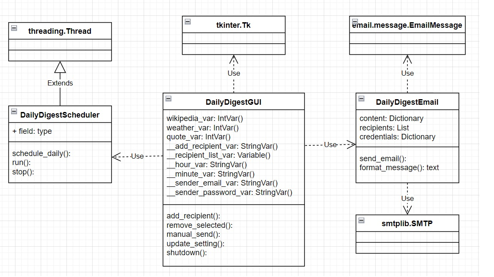

# daily_digest

## Description
Daily Digest is a Python-based desktop application with a graphical user interface built using Tkinter. The application automates the process of sending daily digest emails to a customizable list of recipients. Users can schedule the email delivery time and select the content to include in the digest, such as a weather forecast for a specific location, a random quote, or a Wikipedia article summary, all fetched via APIs. The intuitive control panel allows users to configure content preferences, manage recipient lists, and set the email dispatch schedule.

## Features
- Schedule daily emails to recipients
- Select content types: weather, quotes, Wikipedia summaries
- User-friendly interface built with Tkinter
- Fetch data using APIs

## installation
1. Clone the repository:
   ```bash
   git clone https://github.com/HamedSamavati/daily_digest.git
2. Navigate to the project directory:
cd daily-digest
3. (Optional) Set up a virtual environment:
python -m venv .venv
source .venv/bin/activate  # On Windows use: .venv\Scripts\activate
4. Install the required packages:
pip install -r requirements.txt
## Usage
1. Run the application:
python dd_gui.py
2. Configure the email settings, including recipients and content preferences.
3. Set the schedule for the daily digest email.

## Contributing
If you’d like to contribute to this project, please fork the repository and submit a pull request with your changes.

## License
This project is licensed under the MIT License - see the LICENSE file for details.

## Contact
For any inquiries, feel free to reach out to me at hamedsamavaty@gmail.com.


